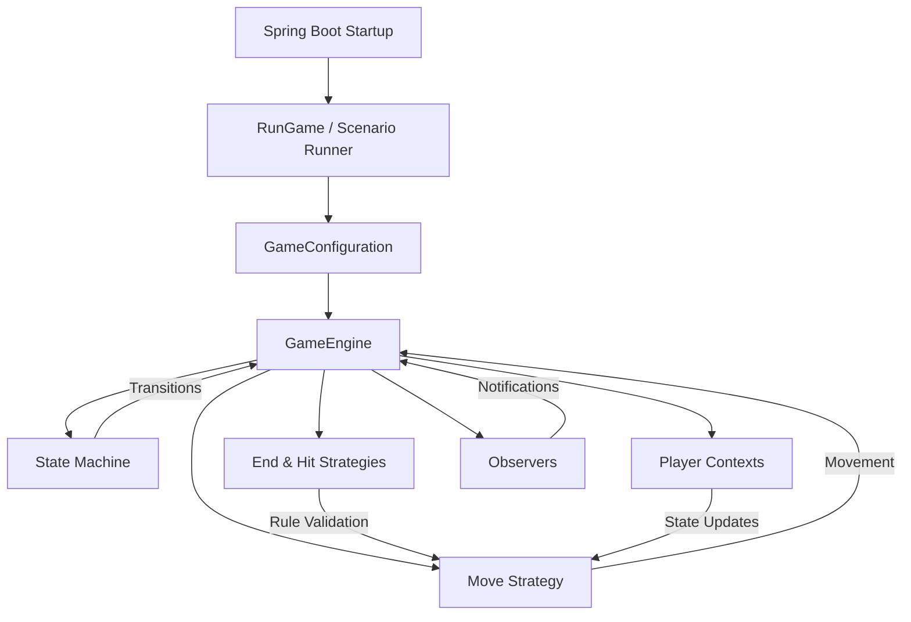
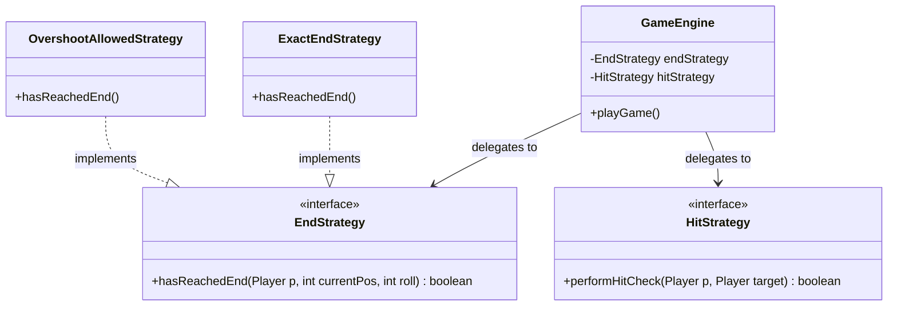

# DanielHall_23748364_FrustrationGame for 6G5Z0059 Software Design and Architecture

The purpose of this README is to cover the variations and features that have been implemented for the Frustration boardgame, as well as an explanation of the designs and clean architecture applied to create it.

## Variations attempted

This table shows the features attempted. In order to demonstrate the features, the executeGame method will **run two simulations** at runtime.
> 1. **All Game Simulations** - a nested loop will run all variations of the game using random dice.
> 2. **The Scenario Runner** will use fixed dice to demonstrate each of the variations as per the assignment spec.

| Feature                                    | Status  | Implementation Detail                                                          | Brief reflection  |
|--------------------------------------------|---------|--------------------------------------------------------------------------------|-------------------|
| **Dice** - single and double dice          | ✅      |                                                                                |                   |
| **Players** - 2 and 4 player               | ✅      |                                                                                |                   |
| **Board** - small and large                | ✅      |                                                                                |                   |
| **End** - exact end or overshoot           | ✅      | Strategy Pattern (ExactEndStrategy vs. OvershootAllowedStrategy)               |                   |
| **Hit** - allow or forfeit                 | ✅      | Strategy Pattern (ForfeitOnHitStrategy vs. AllowHitStrategy)                   |                   |
| **Game State** - Ready, In Play, Game Over | ✅      | State Pattern (Ready, In Play, Game Over)                                      |                   |
| **Dependency Injection**                   | ✅      | Spring Boot dependency injection manages the lifecycle of runners and services |                   |
| **Save and Replay**                        | ✅      |                                                                                |                   |

## Explanation of the Design Patterns used (and the SOLID principles followed)

This section describes how the game flows, the design decisions and how the system applies **SOLID** and **Clean Architecture**. The goal is to demonstrate how each part of the system contributes to a **clean and extensible** game. 

### High Level Game Flow

The following game diagram explains how the game flows. The reason for showing you this? Well, it helps clearly segment the following sections that elaborate on the chosen design and core principles applied.

### Strategy Pattern - handling game variation

As with many game designs, they often involve the need to handle different rule sets (or strategy) without rewriting the core game engine. **Strategy Pattern** is used to encapsulate these algorithms.

Instead of using complex if/else statements inside the game engine, the engine delegates the decision to a Strategy object.

> ☑ SOLID Principles applied

* Open/Closed Principle (OCP): We can add a new winning rule (e.g., "Must roll a 6 to finish") by creating a new class, without modifying the existing GameEngine code.
* Dependency Inversion (DIP): The Engine depends on the abstraction (EndStrategy), not the details (ExactEndStrategy).
The application uses the Spring Boot Framework for Dependency Injection, managing the lifecycle of the game simulation runners while keeping the core domain logic isolated from the framework itself.

> ☑ 
STATE MACHINE

Summary of Responsibilities
Component           Responsibility
State Pattern       Decision Making: "Am I allowed to move? Should the game end now?"
GameEngine          Orchestration: Holds the state and notifies listeners when things change.
Observers           Representation: Translates those changes into text, colors, or logs for the user.

This keeps your code strictly SOLID. 
The State classes are "Closed" to UI changes but "Open" to behavioral changes.

Adding these methods is not only allowed—it is essential for a clean implementation of the State pattern. In software architecture, your GameEngine acts as the Context. For a Context to work with States, it must provide a set of "hooks" (methods) that the States can call to perform actions.

Here is why this approach reinforces SOLID principles rather than breaking them:

1. It adheres to SRP (Single Responsibility Principle)
   Before the state machine, your GameEngine was responsible for two things:

Executing the move (the physics).

Deciding if the move was valid based on the game's lifecycle (the rules).

By adding executeMoveLogic(), the Engine stays responsible for the "How" (physics), while the State classes take over the "When" (rules). You have actually decoupled the decision-making from the execution.

2. It adheres to OCP (Open/Closed Principle)
   The GameEngine is now closed for modification regarding game flow. If you wanted to add a "Paused" state or a "Penalty" state, you wouldn't have to touch a single line of your playGame() loop. You would simply create a new State class and call the existing "hooks" in the Engine.

This structure is SOLID because:

Engine manages the loop.

State manages the lifecycle.

Strategy manages the board math.

Summary for the "Child's Guide" (Delegation)
this: Think of the Robot (GameEngine) handing a walkie-talkie to the Hat (State). The Robot is saying: "Here is this (my walkie-talkie). If you need me to move a piece or change my mood, just call me on it!"

takeTurn(context, roll): This is the Robot saying: "Hat, here is the player and here is the dice number. You decide what happens next."

Why is this good? It keeps the Robot's brain clean. The Robot doesn't need to know if the game is over; it just trusts that the Red Hat (GameOverState) will tell it the truth.

Why this is SOLID:
SRP: The GameEngine loop only cares about the "Turn Order" and the "Safeguard." It doesn't care about the rules of winning; the InPlayState and MoveStrategy handle that.

LSP (Liskov Substitution): We can swap ReadyState for InPlayState or GameOverState at any time, and the takeTurn method still works perfectly because they all follow the same GameState "contract."

REFLECTION
This was as the name suggests, a frustrating, but rewarding challenge.
Unsuprisingly there are many ways to create the game, all with merit, but ultimately this is what I choose.
I needed to start again, re-add Spring Boot.
Get frustated as game looped (end strategy) issue