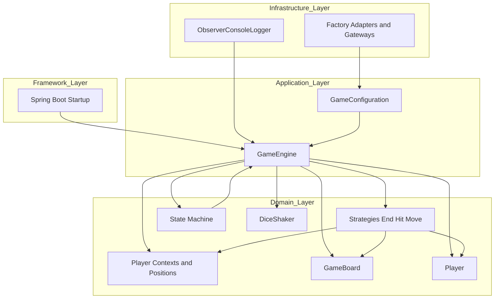
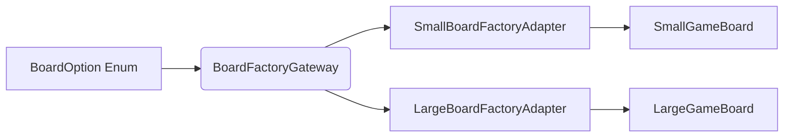
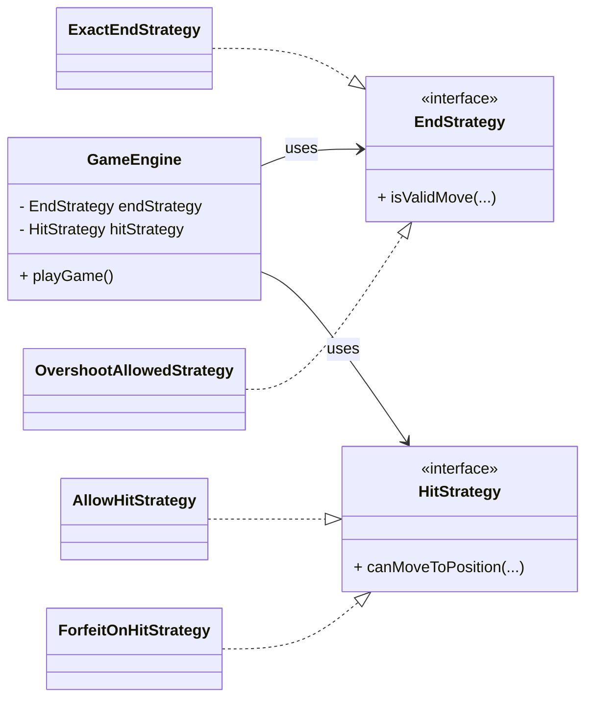
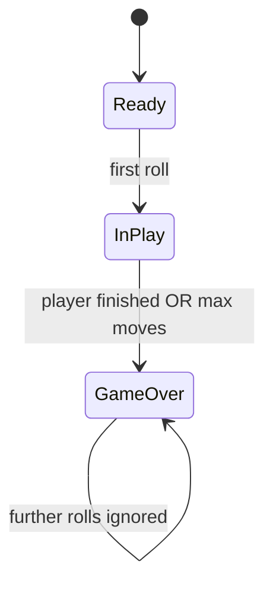
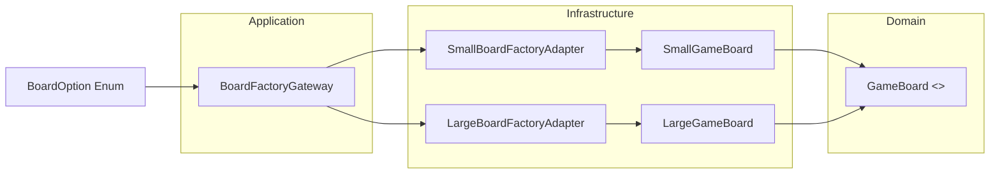
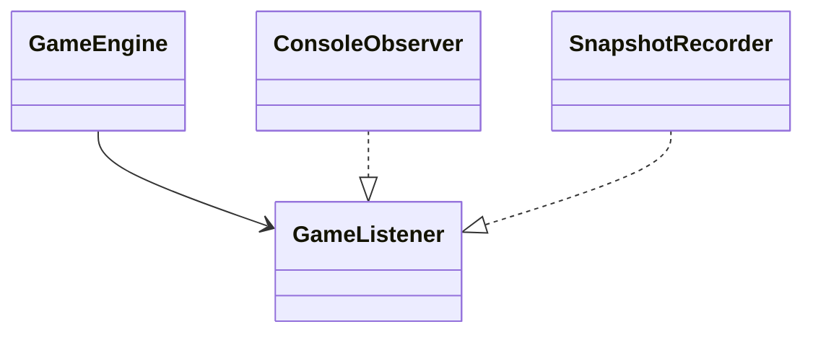
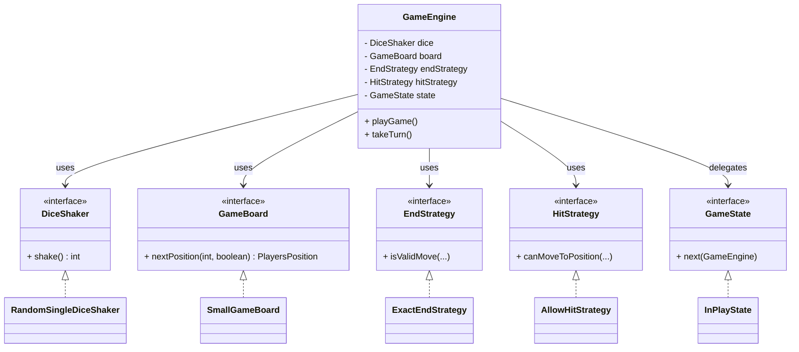
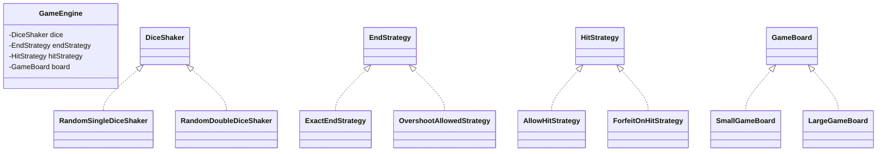

# DanielHall_23748364_FrustrationGame for 6G5Z0059
# Software Design and Architecture

This README explains the **design patterns, architecture** and **implementation decisions** used in the Frustration board game. It assumes the reader is a professional with an implied knowledge of design patterns, SOLID principles and clean architecture - meaning these will not be explicitly explained.
The document is split into two parts:
* **Part A** documents the variations implemented and summarises the design patterns used.
* **Part B** performs a deep-dive into the game flow, providing a more comprehensive view of the design patterns used, how SOLID and Clean Architecture principles are applied and more.

The focus is on **why the system is designed and built that way**. The design is intentionally modular to enable the game to be extensible and testable, following:
* **Clean Architecture** - achieving extensibility through ports and adapters.
* **Design Patterns** - Strategy, State, Factory, Observer and Facades.
* **SOLID principles**
* **Domain-driven modelling** - value objects, invariants, encapsulations and such.
* **Spring Boot** as an outer-layer framework for dependency injection

## Part A. Variations implemented

The game demonstrates all required features and variations (see below table).
In order to demonstrate the features, run the game via the **FrustrationGameApplication** class. This will **run two simulations** at runtime.
> 1. **All Game Simulations** - a nested loop will run every combination of board, dice, players and end/hit game strategies.
> 2. **The Scenario Runner** uses fixed dice to demonstrate each of the variations as per the assignment spec.

| Feature                                         | Status | Where implemented (*the code*)                                                                                  | Why this design is good?                                                                                                                                                                                                                                          |
|-------------------------------------------------|--------|-----------------------------------------------------------------------------------------------------------------|-------------------------------------------------------------------------------------------------------------------------------------------------------------------------------------------------------------------------------------------------------------------|
| **Dice**  (single and double dice)          | ✅      | RandomSingleDiceShaker,  RandomDoubleDiceShaker,  FixedDiceShaker  *created via* DiceFactoryGateway | - Dice behaviour is abstracted behind an Interface.  - New dice types require no game engine changes. - Independent and extensible.                                                                                                                       |
| **Players**  (2 and 4 player)               | ✅      | RedPlayer,  BluePlayer,  GreenPlayer,  YellowPlayer  *created via* PlayerFactoryGateway         | - Player creation is abstracted behind an Interface.  - As above, easy to extend without impacting the engine. - Players are simple value objects.                                                                                                        |
| **Board**  (small and large)                | ✅      | SmallGameBoard,  LargeGameBoard  *created via* BoardFactoryGateway                                      | - Board geometry is polymorphic. - Movement logic is modular and isolated from the game engine. - Boards are stateless value objects.                                                                                                                     |
| **End**  (exact end or overshoot)           | ✅      | ExactEndStrategy vs.  OvershootAllowedStrategy  *created via* EndFactoryGateway                         | - Strategy Pattern isolates volatile behaviour. - Rules are interchangeable. - No logic in the game engine.                                                                                                                                               |
| **Hit**  (allow or forfeit)                 | ✅      | ForfeitOnHitStrategy vs.  AllowHitStrategy  *created via* HitFactoryGateway                             | - Strategy Pattern isolates volatile behaviour. - Collision logic is encapsulted, avoiding complex if/else logic. - No logic in the game engine.                                                                                                          |
| **Game State**  (Ready, In Play, Game Over) | ✅      | ReadyState,  InPlayState,  GameOverState                                                                | - State machine prevents invalid transitions - verifies logic. - Independent. States can be added easily.                                                                                                                                                     |
| **Dependency Injection**  (Spring Boot)     | ✅      | Spring Boot annotations  (e.g @Component, @Service, @Autowired)                                             | - Framework stays outside the domain.                                                                                                                                                                                                                             |
| **Save and Replay**                             | ✅      | PlayersMoveHistoryFileStore, JacksonConfig - ObjectMapper (Jackson))                                            | - Game provides move history snapshots through the Observer pattern.  - Persisted using Jackson configured Spring. - Files save games in json with named ids (unique rather than auto-incremented). Replay game provides overview of the game played. |
| **Unit Testing**                                | ✅      | FixedDiceShaker, MockGameListener, Strategy, State and Board geometry tests.                            | - The architecture naturally supports testing as rules are isolated, dependencies inverted, and side effects are pushed outward.                                                                                                                                  |

#######################################################################################

## Part B. Game Explanation
This will consist of 5 sections:
1. Application of **Clean Architecture**.
2. Application of **Design Patterns**.
3. Application of **SOLID** principles.
4. **Domain modelling**
5. **Evaluation** of the implementation.

# 1. **Clean Architecture**
Before delving into the details, it is useful to provide an overview of the high-level game architecture - *bring it to life*.

The game follows **Clean Architecture** principles throughout (through ports and adapters), ensuring that:
* **All dependencies point inward** towards the stable part of the system - the **Domain Layer**.
* The **domain** contains pur business logic.
* The **Application Layer** orchestrates the domain.
* The **Infrastructure Layer** provides concrete implementations.
* The **Framework Layer** (Spring boot) sits on the outside and never leaks inward.
* **Save and Replay** system retains move histories using JSON. This is an Infrastructure concern and never leaks into the domain.

## Architectural Overview - Game Flow
This diagram acts as a backbone for the more detailed **explanation of the design patterns** and **principles applied**, and the **rationale** for them.

>* ☑ Why is this important?
>* The **Domain** is the core ("Rules of the Game") and consists of pure logic. No Spring, no factories or console in sight.
>* The **Application layer** orchestrates ("How the Game runs") the game, but contains no rules.
>* The **Infrastructure layer** implements interfaces, but depends on the domain for concrete instantiations.
>* The **Framework layer** (Spring) is replaceable and therefore sits independent of the core game. It is the outermost ring that starts the application, wires up dependency injection.

In essence, the Rules in the domain logic stay independent of Sprint Boot, console logging and concrete implementations, keeping the system **extensible, testable and stable** should new/updated variations or rules be added.

## Ports and Adapters - 'how game dependencies flow'

Clean Architecture is implemented using **ports and adapters**.

| Concept      | What do they do?                                                                                                                                                      | Game example                                                                                                                                                                                |
|--------------|-----------------------------------------------------------------------------------------------------------------------------------------------------------------------|---------------------------------------------------------------------------------------------------------------------------------------------------------------------------------------------|
| **Ports**    | **Interfaces** that *define what* the application needs. Two types:                                                                                                   |                                                                                                                                                                                             |
|              | **Driving Ports** External triggers that *drive* the application. APIs that call into the application. E.g. they *prod* the application code to do something. | *StartUp* calls *RunGame.executeGame()*                                                                                                                                                     |
|              | **Driven Ports** Interfaces the application *depend on*. E.g. application uses these to 'do something'                                                        | DiceShaker, GameBoard, EndStrategy, HitStrategy and GameListener are all **interfaces**.                                                                                                    |
| **Adapters** | Perform the **concrete implementations** of driven ports.                                                                                                             | SmallGameBoard and LargeGameBoard would be examples of **concrete implementations** for the GameBoard interface (driven port). Each adapter is responsible for only one type of object. |
| **Gateways** | Dispatchers that **map the user selected game configuration**, in the form of enums, **to adapters** that implement the correct concrete implementation.              | BoardFactoryGateway and DiceFactoryGateway are two examples.                                                                                                                                |

### Example: flow showing Game Board selection

### ☑ Why is this important?
>* **All dependencies point inwards** towards the most stable part of the system - the **domain layer**, with all other aspects of the game dependent on it.
>* The GameEngine **depends only on interfaces**, never concrete class implementations.
>* Adapters isolate volatile behaviour (*rules, board, dice*), and can be added / updated without modifying existing game engine or logic.
>* Enums are used for simplicity in user selection of game instantiation, but also act as **configuration contracts**.
>* Observers and factories can be replaced without touching the GameEngine - making it stable.
>* The strengths here are that the game engine depends on abstract interfaces, rather than concrete implementations - the game is determined at runtime - in line with the **Dependency Inversion Principle (DIP)**.
>* This approach also avoids potentially large switch statements. Instead, the **Single Responsibility Principle** is applied, isolating the 'nuts and bolts' of the game set-up from the actual game engine.
>* Having clear **separation of concerns** make the game easily **extensible and testable**.
>* The system is **open for extension, yet closed for modification** - clearly aligning to the Open/Closed Principles (OCP).

#######################################################################################

# 2. **Design Patterns - where are they used and why?**

#######################################################################################

## A. **Strategy Pattern** - *Rule variations*

Strategy Patterns are used to solve a problem. They encapsulate **volatile behaviour**, such as the game rules and movement logic, and instead of adding complexity within the GameEngine logic, each rule is represented by an interface that can have any number of interchangeable implementations (determined as concrete implementations at runtime).

### Strategy Patterns are used in:
* **MoveStrategy** - Movement logic
* **EndStrategy** - ExactEnd, OvershootAllowed
* **HitStrategy** - AllowHit, ForfeitOnHit
* **DiceShaker** - RandomSingleDiceShaker, RandomDoubleDiceShaker, FixedDiceShaker

### Example - Strategy Pattern demonstrated in the hit/end rules of the game

### ☑ Why is this important?
>* The benefit of using Strategy Patterns is that they can help manage unpredictable behaviours.
>* The game design, means it can **handle different rule sets** (*or strategy*) without rewriting the core game engine - regardless of how big it becomes. (**OCP**)
>* The game engine depends only on **abstractions**, not concrete classes. (**DIP**)
>* A strength of this approach means:
>  * **logic is isolated**, 
>    * rules are **not duplicated**,
>    * strategies / behaviours are **easily updated/added and interchanged** into the game at runtime without impacting the game engine.
>* This design makes what could be problematic and volatile behaviour fully configurable and extensible.

## B. **State Pattern** - *controlling the Game lifecycle*

The State Machine **controls the game lifecycle**, utilising only 3 states in the game: 
1. **ReadyState**
2. **InPlayState**
3. **GameOverState**

Each state defines what transitions are allowed, preventing invalid behaviour (e.g. rolling dice after the game ends).

### Example of the State Machine for this game

### ☑ Why is this important?
>* Using the GameEngine as the orchestrator **avoids creating complex if/else statements** and prevent invalid transitions.
>* Each transition state is **stateless** and **polymorphic**.
>* Contract conditions are in place (*pre-conditions, post-conditions and invariants*) to verify any state transition before it is changed.
>* The design has the benefit of being able to **add further states easily** (e.g. paused, replay) **without impacting the rest of the game application**. Behaviour is **encapsulated**.

## C. **Factory Pattern** - *creating concrete implementations*

Factories and Gateways are used to map configuration enums to concrete implementations, which can be interchanged at runtime. It also enables the GameEngine to remain isolated from game logic.

### Factory Patterns are used in:
* **DiceFactoryGateway**
* **BoardFactoryGateway**
* **PlayerFactoryGateway**
* **HitFactoryGateway**
* **EndFactoryGateway**

### Factory Pattern example (Enum -> Gateway -> Adapter -> Concrete implementation)

### ☑ Why is this important?
>* Keeps the GameEngine 'clean', by avoiding it being cluttered with complex if/else statements that make changes very difficult and time-consuming.
>* Logic is **isolated** and easily modified or added to, without impacting other areas of the game.
>* Concrete **implementations can be determined at runtime**. Avoiding wholesale changes to the game.
>* Aligns with **SRP** and **OCP**.

## D. **Observer Pattern** - *for output*

Observers act as a critical part of the game architecture, **implementing the GameListener** interface, to receive notifications about the game progress.

### Observer Patterns are used in:
* receiving moves, 
* blocked moves, 
* state transitions,
* game over events (*outputting these to the console*), and
* snapshots (*for save and replay*).

### Example - Observer Pattern

### ☑ Why is this important?
>* By using an observer pattern, allows the GameEngine to focus on being a **facade** that coordinates everything, **without containing any business rules/logic, nor any console logic**.
>* Like all areas of this game, Observers have their job, and it is kept **separate from other facets of the game**.
>* The strength of this approach, is observer have one job, that is to provide an update of the game to the user - keeping responsibilities clean. Maintaining **SRP**.
>* New **observers can be added, updated and swapped out (i.e. console could be replaced with GUI, file logging)**. The **GameEngine does not need to change**, it merely notifies listeners fulfilling the **OCP**. 
>* Because all observers follow the same contract and can replace one another, it is in line with the **LSP**.
>* As with all elements of this game, dependencies are inward pointing -**DIP**- the GameEngine knows nothing about the console output, it depends on the GameListener.
>* SnapshotRecorder is an observer that captures move history for Save and Replay.

## E. **Facade Pattern** - *GameEngine*

Facades are a thing of beauty that can *hide a multitude of sins and complexity* behind it.

The **GameEngine acts as a facade** within the game - acting as a front-door. It provides a simple and unified class - integral to **orchestrating the complexities of the game** behind it.

### How are Facade Patterns used?:
The GameEngine facade will take a clients *used cased* (game selection), then:
* Creates the **PlayersPosition** and wraps them in the **PlayersInGameContext**, which is used to monitor and track the movement of each player during the game.
* Delegates movement of players to the **Move Strategy**, based on the rule strategies deployed in the Game Configuration.
* Delegates game rules to the **Hit / End Strategies**, again determined in the Game Configuration.
* Delegates the game lifecycle to the **State Machine**, which orchestrates the state transition updates.
* Delegates notification to **Observers**, which output player/game updates accordingly to the game specification.

### ☑ Why is this important?
>* The GameEngine is a **facade**. It acts as a front, that coordinates everything, **without ever containing any business rules/logic**.
>* It **hides complexity** - keeping the GameEngine small and readable.
>* This makes this approach highly testable, as demonstrated through the use of fixed dice and mock test scenarios.
>* The strength of this is it **reduces coupling** - there is no duplicated logic, and rule logic retains separate and easily interchangeable without impacting the game engine itself (**in line with SRP**).

#######################################################################################

# 3. **SOLID principles - where are they applied**

#######################################################################################

## S - **Single Responsibility Principle** (SRP)

Each class component is **responsible for *one thing***, have should only have one reason to change.

### Examples of **where it is applied**:
* **Dice** classes *only* manage rolls,
* **Strategies** *only* implement specific rule logic,
* **State Machine** *only* manage lifecycle transitions,
* **Observers** *only* output or record event information, and
* **GameEngine** *only* orchestrates - it contains no rule logic.

### ☑ Why is this important for the design
>* Each component has a **single reason to change**.
>* This make these components **easier to test**.
>* Components are **easier to extend / modify**, without impacting other facets of the game.

## O - **Open / Closed Principle** (OCP)

The system is **open for extension**, but **closed for modification**.

### Examples of **where it is applied**:
* The game is specifically design so new behaviours can be added / updated without modifying existing code. For example:
* - Adding new **Dice** types,
* - Adding new **Boards**,
* - Adding new **Rule Strategies** (Hit and End strategies),
* - Adding new **GameState**,
* - Adding new **Observers**.....are all **open for change**, **without modifying existing engine code**, which is closed.

### ☑ Why is this important for the design
>* Fundamentally, there is the **ability to add / update rules without modifying existing code**.
>* This is made possible in the game design through the use of **interfaces**, which enable changes to be **open** to modification.
>* For example, adding new strategy / behaviour rules, such as a *'winning rule'* (e.g. player must roll a 6 to finish) can be created, without modifying the existing GameEngine code.
>* Meanwhile, the GameEngine remains stable and unchanged - **closed to modifications**.

## L - **Liskov Substitute Principle** (LSP)

Any **implementation can replace another** without breaking the system - a *substitution* if you will.

### Examples of **where it is applied**:
* The game relies heavily on Interfaces, allowing any concrete implementation to be swapped easily, without breaking the rest of the game.
* Therefore, this means:
* Any **DiceShaker** can be swapped and used -> without impacting the engine.
* Any **EndStrategy** or **HitStrategy** can be swapped and used -> without impacting the MoveStrategy.
* Any **Player** can be swapped and used -> without impacting the game configuration.
* Any **GameBoard** can be swapped and used -> without impacting the game configuration.
* Any **GameState** can be swapped and used -> without impacting the game engine.

### ☑ Why is this important for the design
>* Polymorphism makes substitution feasible, and ensures consistent behaviour.
>* The game is currently set with a specific game configuration, and a limited number of game rules.....but that doesn't mean this won't change.
>* Using **interfaces allows concrete implementations to be substituted** in/out **without impacting the rest of the game**.
>* This means the system remains stable, whilst the game can easily be extended.
>* Substitution is essential for testing variations of the game, specifically beneficial with the dice - replacing the volatility of a random dice with a fixed sequence - key to test strategies work as expected.
>* Polymorphism through interfaces provides a **level of standardisation** and **prevents side-effects**.

## I - **Interface Segregation Principle** (ISP)

Clients should not depend on methods they do not need, Therefore every **interface** should be **small and focused** on the task at hand.

### Examples of **where it is applied**:
* We have already touched upon Interfaces previously, but to bring this to life. Interfaces in this game are purposely small and focused:
* **DiceShaker** only rolls dice.
* **EndStrategy** only handles end-rule strategy.
* **HitStrategy** only handles collision (hit-rule) strategy.
* **Player** only manages the player config requirements.
* **GameBoard** only manages the board geometry.
* **GameState** only manages the lifecycle of the game.

### ☑ Why is this important for the design
>* Maintaining small and focused interfaces, mean clients depend only on what they actually use - **avoiding *bloated* interfaces**.
>* Interfaces are **easy to implement**, with the concrete implementations being kept separate from the 'front-end' client interface.
>* They also remain easy to mock and test.

## D - **Dependency Inversion Principle** (DIP)

DIP is possibly the most important principle applied in the game. The purpose of DIP is to ensure the GameEngine depends only on **abstractions**, not concrete classes.
In reality, this means:
* GameEngine (higher-level module) **depends on interfaces**, not concrete classes. 
* RandomSingleDiceShaker, SmallGameBoard, ExactEndStrategy etc. (lower‑level modules) **implement those interfaces**.
* This demonstrates DIP - **dependencies point inward toward the domain**.

### Examples of **where it is applied**:
* **GameEngine** *depends on* **DiceShaker** interface, not any concrete implementation (i.e. RandomSingleDiceShaker).
* **GameEngine** *depends on* **EndStrategy** interface, not any concrete implementation (i.e. ExactEndStrategy).
* **GameEngine** *depends on* **HitStrategy** interface, not any concrete implementation (i.e. AllowHitStrategy).
* **GameEngine** *depends on* **Player** interface, not any concrete implementation (i.e. RedPlayer).
* **GameEngine** *depends on* **GameBoard** interface, not any concrete implementation (i.e. SmallGameBoard).
* **GameEngine** *depends on* **HitStrategy** interface, not any concrete implementation (i.e. AllowHitStrategy).
* **Observers** *depend on* **GameListener** interface, not any console logging.

### Example of DIP from the game:

### ☑ Why is this important for the design
>* The Dependency Inversion Principle is a valuable principle in the game design, and is the **bedrock of the Clean Architecture - Ports and Adapters design**.
>* It allows **runtime configuration and testing**.
>* Makes the game more **extensible and testable**.
>* Keeps the game domain **independent of the infrastructure**.

## Summary of key SOLID designs

| Principle | Application                                                                                                                                                              | What is the importance?                                        |
|-----------|--------------------------------------------------------------------------------------------------------------------------------------------------------------------------|----------------------------------------------------------------|
| **SRP**   | Dice *only* manages rolls, strategies *only* decide rule application, state machine controls lifecycle,  observers *only* output and GameEngine *only* orchestrates. | Each class is responsible for one thing.                       |
| **OCP**   | Game set-up (dice, board, player, states and strategies).                                                                                                                | Ability to add / update rules without modifying existing code. |
| **LSP**   | Any dice, board, player, state or strategy can replace another.                                                                                                          | Polymorphism enables substitution.                             |
| **ISP**   | Any interface - DiceShaker, EndStrategy, HitStrategy, Player, GameBoard, GameState.                                                                                      | Interfaces are small and focused.                              |
| **DIP**   | Game relies on inward dependencies, specifically on abstract interfaces, not concrete implementations.                                                                   | Allows runtime configuration and testing.                      |

#######################################################################################

# 4. **Domain Modelling**

#######################################################################################

The domain model is at the centre of the game, as it contains all business rules, invariants, and state transitions. Therefore, focus should be given to it.
* This section explains how the domain has been structured and why it matters. 
* It covers a high-level view on records, value objects, invariants, encapsulation, stateful vs stateless modelling — core to the game domain model.
* These concepts may have been referenced already as they underpin the previously discussed SOLID, Clean Architecture and design pattern decisions.

## **Records**

Java **Records** are used for *identity objects* of *immutable configuration*, where behaviour is minimal and purpose of the object is to carry data safely and transparently. 

They are Data Transfer Objects (DTO) used to carry immutable data.

In this game, **Players** are the only domain concept that could be considered for **Records**:
* A Player’s identity (*colour, name, starting position*) does not change during the game.
* Any **mutable behaviour** during the game is **handled by PlayerContext**, *not* the Player itself.
* Players do not enforce invariants or contain domain logic.

### ☑ Why Records were not used?
Whilst feasible, they were discounted because: 
* Players must implement the Player interface - using records would add little obvious benefit or simplicity to the code.
* The current design already keeps Player objects simple and immutable.

### ☑ Why Records would be useful

* Strengthen the concept that Players are pure identity objects.
* Guarantees immutability.
* Reduce boilerplate - *although, marginally here*.
* Make the domain model more explicit.

## **Player Context**

The *PlayersInGameContext* is a **stateful domain entity** that holds a representation of everything the game needs to know about a given player *during* the game itself.

* In the game examples:
  * current board index
  * steps taken and move count
  * whether they are in the board/tail
  * whether the finished flag is set - ending the game
  * a PlayersPosition and PlayersMoveHistory - both value objects
* In essence, this does not track a players colour or where they start on the board. But the **current state / position** of the player in the game.

### ☑ Why is this important for the design
* Player Context centralises player movement into one clear encapsulated domain entity, with controlled methods used to mutate it during the game.
* Without PlayerContext to manage the players in game context, then the game would have duplicated logic, scattered state with no clear mechanism to track move history, no way to protect against invalid move (*via value objects*) or to enforce against invariants.
* Value Objects manage the common / shared board to compare equality across players.
* Domain invariants are enforced - cannot move after finishing.

## **Encapsulation**

Encapsulation is used extensively to **protect the domain**. This involves the use of packages and private / public fields to ony expose data to view/modify when we want to, and protect it when we don't. 

Within the game examples:
* PlayersPosition fields are private
* PlayerContext exposes methods like advancePosition() rather than exposing fields
* Move history is updated via controlled mechanisms (methods).
* GameState transitions can only be *triggered* via the State Machine.

### ☑ Why is this important for the design
* Prevents changes being made to game states in error / maliciously.
* Reduces complexity and makes the domain more robust.

## **Stateful vs Stateless Modelling**

The domain deliberately separates **stateful** and **stateless** components. Examples of both include:

**Stateless components** - should contain behaviour, not state!
* Strategies
* GameState
* Dice Shakers (excluding fixed dice)
* Boards
* Players

**Stateful components**
* PlayerContext
* MoveHistory
* Game Snapshots (for Save and Replay)

### ☑ Why is this important for the design
* Separation og concerns, ensures Stateless components are isolated and easy to modify/test.
* Stateful components are isolated and controlled.
* The GameEngine can continue to orchestrate State transitions without holding state itself. 
* Having this separation ensures predictability and keeps the Architecture Clean.

#######################################################################################

# 5. **Evaluation - a reflection on the implementation (and some honest reflections)**

#######################################################################################

## Personal Reflection
This was as the name suggests, a frustrating, but rewarding challenge. Unsurprisingly there are many ways to generate this game, all with some merit. I've had to re-start from scratch after GitHub failed me, and got really annoyed when my game went into an infinite loop from time to time. Eventually realising it was due to the exact end strategy and random dice, I added a maximum number of game turns before exiting the game. I've continually added further builds, but ultimately this is what I felt worked best.
That said, the game demonstrates Clean Architecture, SOLID principles, and strong design patterns. This results in a simple game, easy to extend, without infinite loops, rule conflicts or configuration complexity.

## ☑  What works well:
* **Clean Architecture is applied**
  * All **dependencies point inward** towards the domain.
  * Spring Boot remains in the **outer ring**, responsible only for wiring and lifecycle.
  * It requires discipline. It may feel like more work to begin with, but it provides improved clarity for anyone that needs to read your code.
* Strong **separation of concerns**
  * Ensures **responsibility** rules, game set-up, output and lifecycle states are **isolated** - no duplication of logic.
  * Highly **extensible and testable** - allowing new game logic and rules to be added/modified with ease.
  * Changes in one area do not impact other areas.
  * Strategy and State patterns are vital in breaking down complex logic into separate classes of single responsibility that can be plugged in and tested easily. Avoiding painful and complex if/else statements.
* Ability to **configure the game at runtime**.
  * Ports, Adapters and Gateways are used to enable configuration to be determined at runtime, making any changes to game configuration simple.
  * This is something that is vital in day to day life, where volatile variables (i.e. taxes, suppliers) can change regularly, and you need to be able to interchange these easily without impacting the rest of your system.
* **Encapsulation** and **Value Objects** ensure classes and game logic are suitably managed.
  * Avoids changes being made in accident or maliciously. Ultimately preventing potential bugs and errors.
* **Spring Boot** is very powerful, yet it should only be responsible for wiring the game together. It should be isolated from game logic.
* **Save and Replay** 
  * Move histories are persisted using JSON, with replay reconstructing chosen game. 
  * The domain remains clean.

## What could I have done differently?
Aside from writing a shorter README (*sorry for that*)....

* **Package Structure** - if time allowed, it may have been prudent to restructure the package structure to a more explicit Clean Architecture folder layout to increase readability.
  * For example:
    - board, dice, players, gamestrategies → domain
    - rungame → application
    - factories.*, gameobserver → infrastructure
    - boot → framework
    
* **Decorator Pattern**
  * It was feasible that some rule combinations could benefit from the Decorator Pattern, i.e. penalties layered on top of hit rules. In this basic game it was discounted, but arguably it would allow rule composition, without modifying existing strategies.

* **Use of Records**
   
  * As noted previously, Players could be implemented as records and they remain a feasible option. On this occasion,the current design seemed appropriate.

* **Save and Replay** - unique ID

  * As this is a basic example to show the functionality, the game uses a rather large ID to save the game to ensure the client can find the specific game they wish to replay. It was feasible to add a basic incremental ID, but for the purposes of this game, it explicitly highlights the game configuration chosen and assigns a unique ID - overkill, but it works.

* **Explicit Error Handling**
  * The majority of the game makes the assumption everything is a valid configuration. Adding further error handling might prove more robust, especially should the game be further extended.