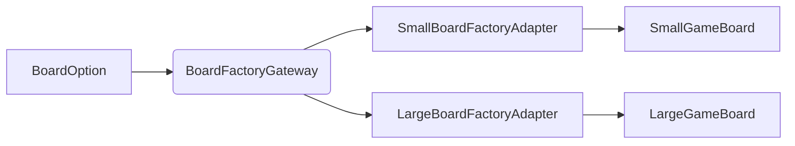
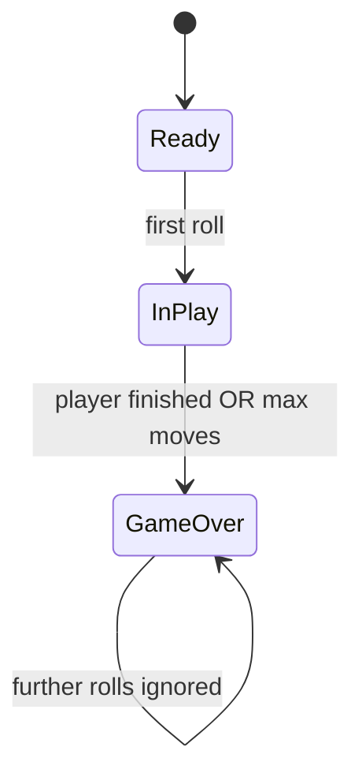
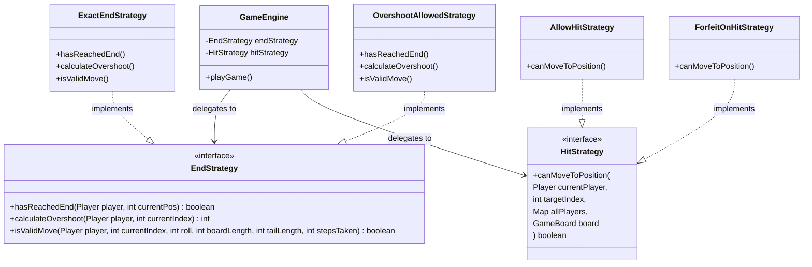

# DanielHall_23748364_FrustrationGame for 6G5Z0059
# Software Design and Architecture

The purpose of this README is to cover the variations and features that have been implemented for the Frustration boardgame, as well as an explanation of the designs and clean architecture applied to create it.

## Variations attempted

This table shows the features attempted. In order to demonstrate the features, the executeGame method will **run two simulations** at runtime.
> 1. **All Game Simulations** - a nested loop will run all variations of the game using random dice.
> 2. **The Scenario Runner** will use fixed dice to demonstrate each of the variations as per the assignment spec.

| Feature                                    | Status  | Implementation Detail                                                          | Brief reflection  |
|--------------------------------------------|---------|--------------------------------------------------------------------------------|-------------------|
| **Dice** - single and double dice          | ✅      |                                                                                |                   |
| **Players** - 2 and 4 player               | ✅      |                                                                                |                   |
| **Board** - small and large                | ✅      |                                                                                |                   |
| **End** - exact end or overshoot           | ✅      | Strategy Pattern (ExactEndStrategy vs. OvershootAllowedStrategy)               |                   |
| **Hit** - allow or forfeit                 | ✅      | Strategy Pattern (ForfeitOnHitStrategy vs. AllowHitStrategy)                   |                   |
| **Game State** - Ready, In Play, Game Over | ✅      | State Pattern (Ready, In Play, Game Over)                                      |                   |
| **Dependency Injection**                   | ✅      | Spring Boot dependency injection manages the lifecycle of runners and services |                   |
| **Save and Replay**                        | ✅      |                                                                                |                   |

## Explanation of the Design Patterns used (and the SOLID principles followed)

This section describes how the game flows, the design decisions and how the system applies **SOLID** and **Clean Architecture**. The goal is to demonstrate how each part of the system contributes to a **clean, easily extensible and testable** game. 

### High Level Game Flow

The following game diagram explains how the game flows. The reason for showing you this? Well, it helps clearly segment the following sections that elaborate on the chosen design and core principles applied.

## 1. Spring Boot Startup (Framework layer)
* Spring Boot starts the application - the entry point for the entire game engine.
* The StartUp class is a **Spring Component** that listens for the ApplicationReadyEvent, which on activation, will trigger the **RunGame** service.

> ☑ **Rationale for the design**
* Dependency Injection provides a cleaner Architectural Framework.
* Ensures the overall game logic is not tied to Spring.
* Maintains the framework in the 'outer ring' - **ADD MORE DETAILS AND SPECIFIC INCLUDING USE OF COMPONENT AND SERVICE ANNOTATIONS? IMPORTANCE AND WHY CHOSEN.**

## 2. Run Game / Scenario Runner
* Game configuration can be injected into Spring StartUp application, keeping them distinctly separate entities.
* **ScenarioRunner and RunGameSimulations** then generate the required **GameConfiguration**.

> ☑ **Rationale for the design**
* Again, Dependency Injection provides a cleaner Architectural Framework with the game logic not tied to Spring.
* Having specific game scenarios and simulation classes, allows users to specify what variations of the game they want to run centrally, without impacting the actual game set-up and logic.
* This supports the Single Responsibility Principles and improves game extensibility.

## 3. Game Configuration (Ports and Adapters Layer)
* This is where the orchestration for the game takes place. **GameConfiguration builds the game specification** chosen using:
  * **Factory Interfaces** (*ports*) - **MORE DETAIL REQUIRED HIGHLIGHTED IN THE DIAGRAM** role is to define abstract creation ports.......meaning
  * **Adapters** (*implementations*) - **MORE DETAIL REQUIRED** role here is to provide the concrete implementations, based on the users selection.....meaning
  * **Gateways** (*dispatchers*) - **MORE DETAIL REQUIRED** role is to dispatch (NOT GOOD WORD) based on enums the user selection, which are then implemented via the adapters that determine the concrete instantiation required.

### Demonstrating the Factory, Gateway and Adapter set-up demonstration for the Game Board selection (small/large)  

> ☑ **Rationale for the design**
* Using Factories, Gateways and Adapters for specific game set-up activities, means that extending the game (board, dice, rule strategy) requires no changes to the engine. Perfect for **separation of concerns**. 
* **Open/Closed principle** applies to the Board, Dice and Game Strategies, making updates and further extensions simple without modifying the existing game engine. E.g. adding a 3rd dice, bigger board or different strategy is simple as they are open to change without impacting the closed game engine.
* **Dependency Inversion Principle (DIP)** means that the game engine depends on abstract interfaces, rather than concrete implementations. This allows the game to be determined at runtime.
  * Enums are utilised for the various chosen game implementations to simplify instantiation and separate concerns into cleaner encapsulation.
* **Single Responsibility Principle** is key to the game configuration, ensuring the 'nuts and bolts' of the game set-up are isolated from the actual running of the game. This makes game extensibility far easier.

## 4. Game Engine (Application Layer)
The GameEngine is integral to the overall Frustration Game - it **receives the users selection for *number of players, board size, number of dice, game strategy (end and hit) and listeners***
It then orchestrates the game:
* Creating the **PlayersPosition** and wrapping them in the **PlayersInGameContext**, which is used to monitor and track the movement of each player during the game.
  * **TBC Value Objects** are utilised for Players in order to compare board position equality during the game - required to support the Hit Strategy application.
* Creating the **Move Strategy** that players must adhere to, based on the rule strategies deployed in the Game Configuration.
* Setting the **State Machine** to the initial 'ReadyState', and orchestrating the state transition updates.
* Notifying the **Observers** of player/game updates required for tracking and updating the console user of the game progress.

> ☑ **Rationale for the design**
* The GameEngine is in essence, purely a **orchestrator** of the game - there is **no logic held inside the engine**.
* Makes testing game configuration and set-ups easier.
* **TBC - need more SOLID principles**

## 5. State Machine
The State Machine **controls the game lifecycle**. This game deploys a fairly simplistic state machine utilising only 3 states. (CHECK UNI MATERIAL)
### Example below, shows the State Machine for this game

ALSO REFERENCE THE FACT IF ALLOWS TO SAY GAME OVER IF FORCE ANOTHER DICE ROLL, PROVEN USING A TEST CASE - SPECIFY WHICH ONE.
> ☑ **Rationale for the design**
* Using the GameEngine as the orchestrator **avoids creating complex if/else statements** and prevent invalid transitions.
* Makes adding further states easy (e.g. paused, replay) without impacting the rest of the game application.
* Maintains Single Responsibility Principles.
* **TBC - need more SOLID principles**

## 6. Move Strategy (Strategy Layer logic)

Pre and post validation of these. Inverters or something I took a pic of. Checks of the rules.
## 7. End & Hit Strategies (Strategy Pattern - handling game variation)
As with many game designs, they often involve the **need to handle different rule sets** (*or strategy*) without rewriting the core game engine. **Strategy Pattern** is used to encapsulate these algorithms.

Instead of using complex if/else statements inside the game engine, the engine delegates the decision to a Strategy object.

> ☑ SOLID Principles applied

* Open/Closed Principle (OCP): We can add a new winning rule (e.g., "Must roll a 6 to finish") by creating a new class, without modifying the existing GameEngine code.
* Dependency Inversion (DIP): The Engine depends on the abstraction (EndStrategy), not the details (ExactEndStrategy).
The application uses the Spring Boot Framework for Dependency Injection, managing the lifecycle of the game simulation runners while keeping the core domain logic isolated from the framework itself.

> ☑ 
STATE MACHINE

Summary of Responsibilities
Component           Responsibility
State Pattern       Decision Making: "Am I allowed to move? Should the game end now?"
GameEngine          Orchestration: Holds the state and notifies listeners when things change.
Observers           Representation: Translates those changes into text, colors, or logs for the user.

This keeps your code strictly SOLID. 
The State classes are "Closed" to UI changes but "Open" to behavioral changes.

Adding these methods is not only allowed—it is essential for a clean implementation of the State pattern. In software architecture, your GameEngine acts as the Context. For a Context to work with States, it must provide a set of "hooks" (methods) that the States can call to perform actions.

Here is why this approach reinforces SOLID principles rather than breaking them:

1. It adheres to SRP (Single Responsibility Principle)
   Before the state machine, your GameEngine was responsible for two things:

Executing the move (the physics).

Deciding if the move was valid based on the game's lifecycle (the rules).

By adding executeMoveLogic(), the Engine stays responsible for the "How" (physics), while the State classes take over the "When" (rules). You have actually decoupled the decision-making from the execution.

2. It adheres to OCP (Open/Closed Principle)
   The GameEngine is now closed for modification regarding game flow. If you wanted to add a "Paused" state or a "Penalty" state, you wouldn't have to touch a single line of your playGame() loop. You would simply create a new State class and call the existing "hooks" in the Engine.

This structure is SOLID because:

Engine manages the loop.

State manages the lifecycle.

Strategy manages the board math.

Summary for the "Child's Guide" (Delegation)
this: Think of the Robot (GameEngine) handing a walkie-talkie to the Hat (State). The Robot is saying: "Here is this (my walkie-talkie). If you need me to move a piece or change my mood, just call me on it!"

takeTurn(context, roll): This is the Robot saying: "Hat, here is the player and here is the dice number. You decide what happens next."

Why is this good? It keeps the Robot's brain clean. The Robot doesn't need to know if the game is over; it just trusts that the Red Hat (GameOverState) will tell it the truth.

Why this is SOLID:
SRP: The GameEngine loop only cares about the "Turn Order" and the "Safeguard." It doesn't care about the rules of winning; the InPlayState and MoveStrategy handle that.

LSP (Liskov Substitution): We can swap ReadyState for InPlayState or GameOverState at any time, and the takeTurn method still works perfectly because they all follow the same GameState "contract."

## 8. Player Contexts

## 9. Observers

REFLECTION
This was as the name suggests, a frustrating, but rewarding challenge.
Unsuprisingly there are many ways to create the game, all with merit, but ultimately this is what I choose.
I needed to start again, re-add Spring Boot.
Get frustated as game looped (end strategy) issue

DON'T FORGET TO REFERENCE ENCAPSULATION, ENUMS, OBJECT ORIENTATION, POLYMORPHISM ETC.