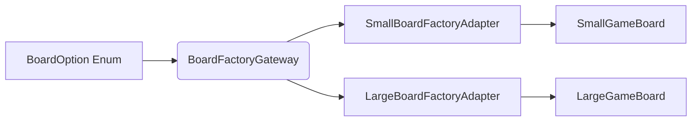
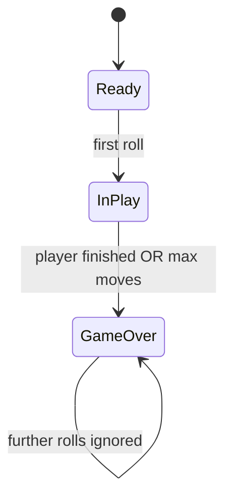
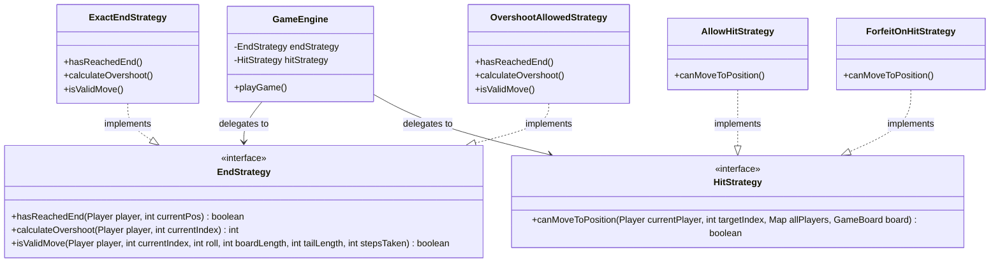
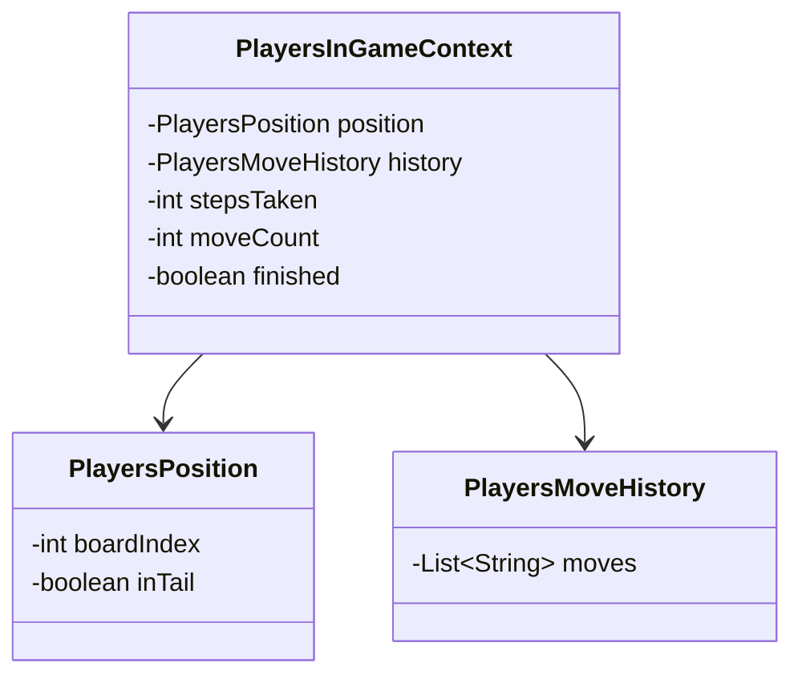
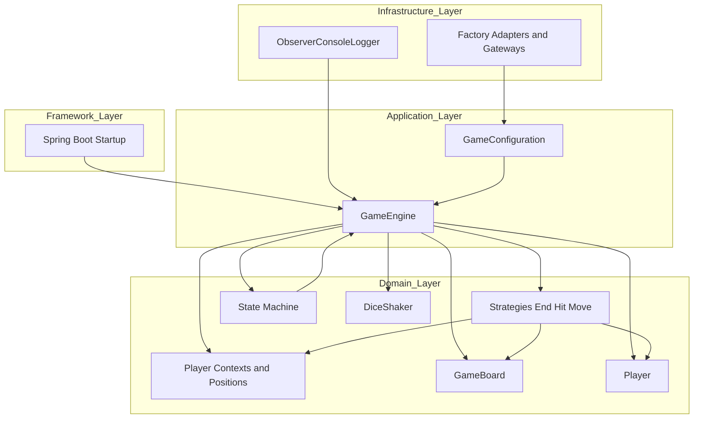

# DanielHall_23748364_FrustrationGame for 6G5Z0059
# Software Design and Architecture

This README explains the **design, architecture** and **implementation** of the Frustration board game.
The document is split into two parts:
* **Part A** documents the variations implemented and summarises the design patterns used. 
* **Part B** performs a deep-dive into the game flow, providing a more comprehensive view of the design patterns used, how SOLID and Clean Architecture principles are applied and more.

The aim being to show not just what was built, but why it was built that way - showcasing how the design is SOLID and achieves extensibility through ports, adapters, factories, and domain‑driven abstractions.

## Part A. Variations implemented

The game demonstrates all required features and variations (see below table).
In order to demonstrate the features, run the game via the **FrustrationGameApplication** class. This will **run two simulations** at runtime.
> 1. **All Game Simulations** - a nested loop will run every combination of board, dice, players and end/hit game strategies.
> 2. **The Scenario Runner** uses fixed dice to demonstrate each of the variations as per the assignment spec.

| Feature                                    | Status | Implementation Details (the code)                                                                               | Why this design is good?                                                                                                                                                                                                                                                   | SOLID principles demonstrated                                                                                                  |
|--------------------------------------------|--------|-----------------------------------------------------------------------------------------------------------------|----------------------------------------------------------------------------------------------------------------------------------------------------------------------------------------------------------------------------------------------------------------------------|:-------------------------------------------------------------------------------------------------------------------------------|
| **Dice** - single and double dice          | ✅      | RandomSingleDiceShaker,  RandomDoubleDiceShaker,  FixedDiceShaker  *created via* DiceFactoryGateway | - Dice behaviour is abstracted behind an Interface, with concrete dice implementations determined at runtime via gateways/adapters. - No game engine changes required. - Independent and extensible.                                                               | **OCP** - easy to add / update dice types. **DIP** - engine depends on DiceShaker interface. **SRP** - dice only roll. |
| **Players** - 2 and 4 player               | ✅      | RedPlayer,  BluePlayer,  GreenPlayer,  YellowPlayer  *created via* PlayerFactoryGateway         | - Player creation is abstracted behind an Interface, again this works best to allow concrete implementation at runtime. - Adding further players requires no changes to the game engine. Players are simple value objects.                                         | Similar principles to above. **OCP, DIP** and **SRP** compliant. **Encapsulation**                                             |
| **Board** - small and large                | ✅      | SmallGameBoard,  LargeGameBoard  *created via* BoardFactoryGateway                                      | - Board geometry uses Interfaces, with adapters/gateways delivering the implementation requested at runtime. - Movement logic is modular and is distinct from the game engine. Boards are stateless value objects.                                                 | Similar principles to above. **OCP, DIP** and **SRP** compliant. **Polymorphism**                                              |
| **End** - exact end or overshoot           | ✅      | ExactEndStrategy vs.  OvershootAllowedStrategy  *created via* EndFactoryGateway                         | - Uses Strategy Patterns. - End rules are isolated, avoiding complex if/else logic. - Easy to add or update end strategies. - Clean separation of rules. No logic in the game engine, making changes independent and increasingly extensible and testable. | **Strategy pattern, OCP** and **DIP** compliant. **LSP**                                                                       |
| **Hit** - allow or forfeit                 | ✅      | ForfeitOnHitStrategy vs.  AllowHitStrategy  *created via* HitFactoryGateway                             | - Uses Strategy Patterns. - Collision rules are isolated, avoiding complex if/else logic. - Easy to add or update hit strategies. - No logic in the game engine, making changes independent and increasingly extensible and testable.                          | Similar principles to above. **Strategy pattern, OCP** and **DIP** compliant. **LSP**                                          |
| **Game State** - Ready, In Play, Game Over | ✅      | ReadyState,  InPlayState,  GameOverState                                                                | - Prevents invalid transitions - verifies logic. - Simple, avoiding complex if/else logic. - Independent, allowing further states to be added easily.                                                                                                              | **State pattern, SRP** and **OCP** compliant. **LSP**                                                                          |
| **Dependency Injection**                   | ✅      | Spring Boot annotations  (e.g @Component, @Service, @Autowired)                                             | - Spring Boot dependency injection manages the lifecycle of runners and services. - Framework is isolated.                                                                                                                                                             | Clean Architecture - **DIP** and **SRP** compliant.                                                                            |
| **Save and Replay**                        | ✅      | TBC                                                                                                             |                                                                                                                                                                                                                                                                            |                                                                                                                                |
| **Unit Testing**                           | ✅      | TBC                                                                                                             |                                                                                                                                                                                                                                                                            |                                                                                                                                |

## High Level Game Flow

The following game diagram explains how the game flows.

This diagram acts as a backbone for the more detailed **explanation of the design patterns** and **principles applied**, and the **rationale** for them.

## Part B. Game Design Pattern explanation

## 1. Spring Boot Startup (Framework layer)
### What it does
* Spring Boot starts the application, acting as the entry point for the entire game engine.
* The **StartUp** class is a **Spring Component** and **driving adapter**. It listens for the ApplicationReadyEvent, which on activation, *drives* the application by triggering the **RunGame** service.
* Spring Boot will then **manage the Object lifecycle, Dependency Injection** and **Wiring of services** (e.g. *@Service, @Component*).
* No domain class will import Spring.

### ☑ Why is this important for the design
* Spring Boot Dependency Injection provides a cleaner Architectural Framework, often mandatory for building enterprise applications. 
* The application uses the Spring Boot Framework for Dependency Injection, wiring everything together, holding bean definitions and instances and managing the lifecycle.
* Maintains the framework in the 'outer ring', while keeping the core domain logic isolated from the Spring framework itself.
* Supports Clean Architecture and the dependency rule: **Framework -> Infrastructure -> Application -> Domain**.
>* The strength of this approach (dependency injection) over alternatives is it removes hard-coded dependencies wiring the game, removes tight coupling and static factories and testability. Spring manages this efficiently.

## 2. Run Game / Scenario Runner (Driving Ports)
### What it does
* Driving ports **prod the application code 'to do something'**. 
* In this case, these classes **drive** the application by selecting which scenarios are run (**ScenarioRunner and RunGameSimulations**).
* This in turn creates *GameConfiguration* objects that are injected via Spring during application StartUp.

### ☑ Why is this important for the design
* Keeps scenario configuration logic separate from the actual game logic - users specify what variations of the game they want to run centrally, without impacting the actual game set-up and logic.
* Allows the addition of new scenarios to be implemented easily.
* Fully aligns to **Single Responsibility Principles (SRP)** and **Open/Closed principles** and improves game extensibility.
* Dependency Injection (as should always be the case) points inwards - **TBC to validate if true and WHY IMPORTANT , removing reliance ON ......** 
>* The strength here is that there is no hard-coded game configuration scenarios within the game engine, nor duplication of set-up logic.

## 3. Game Configuration (Ports and Adapters Layer)
* This is where the **orchestration** and **assembly** for the game takes place.
* **GameConfiguration builds the game specification** chosen using three key concepts:
  * **Ports** (*factory interfaces*)
  * **Adapters** (*implementations*)
  * **Gateways** (*dispatchers*)

| Concept      | What do they do?                                                                                                                                                                                                                                                                                | Examples from the game                                                                                                                                                                 |
|--------------|-------------------------------------------------------------------------------------------------------------------------------------------------------------------------------------------------------------------------------------------------------------------------------------------------|----------------------------------------------------------------------------------------------------------------------------------------------------------------------------------------|
| **Ports**    | Interfaces that *define what* the application needs. Two types: **Driving ports**: APIs that call into the application. E.g. they *prod* the application code to do something. **Driven ports**: Interfaces the application *depends on*. E.g. application uses these to 'do something' |  *StartUp* calls *RunGame.executeGame()*. *BoardFactory, DiceFactory, HitStrategy, EndStrategy* are interfaces the game depend on to implement game configuration of the user. |
| **Adapters** | Perform the **concrete implementation** defined by the ports. TBC - ports are interfaces that enable adapters to implement user selections at runtime. SRP compliant.                                                                                                                           | *SmallBoardFactoryAdapter* and *TwoDiceFactoryAdapter*, represent concrete implementations of the driven port interfaces.                                                              |
| **Gateways** | Dispatchers that **map the user selected game configuration**, in the form of enums, **to adapters** that implement the correct concrete implementation.                                                                                                                                        | *BoardFactoryGateway*                                                                                                                                                                  |

### Diagram demonstrates the Factory, Gateway and Adapter set-up for the Game Board selection (small/large)  

### ☑ Why is this important for the design
* The Game Engine **depends only on interfaces**, not implementations.
* This means that extending the game (board, dice, rule strategies) require **no changes to the engine**. Perfect for **separation of concerns**.
* Enums are used for simplicity in user selection of game instantiation, but also act as **configuration contracts**.
>* The strengths here are that the game engine depends on abstract interfaces, rather than concrete implementations - the game is determined at runtime - in line with the **Dependency Inversion Principle (DIP)**. 
>* There is no hard-coded logic. The Board, Dice and Game Strategies are *open* and can be updated/added to easily without modifying the existing *closed* game engine - an example of the **Open/Closed principle**.
>* This approach also avoids potentially large switch statements. Instead, the **Single Responsibility Principle** is applied, isolating the 'nuts and bolts' of the game set-up from the actual game engine. This makes game extensibility far easier.

## 4. Game Engine (Application Layer)
The GameEngine is integral, it **orchestrates the Frustration game**.
After receiving the users selection, it:
* Creates the **PlayersPosition** and wraps them in the **PlayersInGameContext**, which is used to monitor and track the movement of each player during the game.
* Delegates movement of players to the **Move Strategy**, based on the rule strategies deployed in the Game Configuration.
* Delegates game rules to the **Hit / End Strategies**, again determined in the Game Configuration.
* Delegates the game lifecycle to the **State Machine**, which orchestrates the state transition updates.
* Delegates notification to **Observers**, which output player/game updates accordingly to the game specification.

### ☑ Why is this important for the design
* The GameEngine is a **facade**. It acts as a front, that coordinates everything, **without ever containing any business rules/logic**.
* This makes this approach highly testable, as demonstrated through the use of fixed dice and mck test scenarios.
>* The strength of this is, there is no duplicated logic, and rule logic retains separate and easily interchangeable without impacting the game engine itself (**in line with SRP**).

## 5. State Machine (State Pattern)
The State Machine **controls the game lifecycle**. This game deploys a fairly simplistic state machine utilising only 3 states. (**TBC CHECK UNI MATERIAL**)

### Diagram below demonstrates the State Machine for this game

**ALSO REFERENCE THE FACT IF ALLOWS TO SAY GAME OVER IF FORCE ANOTHER DICE ROLL, PROVEN USING A TEST CASE - SPECIFY WHICH ONE.**

### ☑ Why is this important for the design
* Using the GameEngine as the orchestrator **avoids creating complex if/else statements** and prevent invalid transitions.
* Each transition state is **stateless** and **polymorphic**.
>* A strength here is that, adding further states is easy (e.g. paused, replay) without impacting the rest of the game application. Behaviour is encapsulated.

## 6. Move Strategy (Strategy Layer logic / Domain Service)
Move Strategy is integral to the game (like everything I guess), because it handles a players movements. More specifically, the **StandardMoveStrategy** class is responsible for:
1. **Calculation of a players position** / potential movement based on their dice roll.
2. **TBC PRE AND POST VALIDATORS**. Validates potential movement dependent on the **EndStrategy and HitStrategy** applied.
3. **Applying the move** (assuming valid).
4. **Notifying observers** - in order that game progress is recorded and output appropriately.
5. **Highlighting a player finishing** and winning the game. Driving the final result output.

### ☑ Why is this important for the design
* Whilst this game demonstrates two strategies, this design **allows further movement rules to be simply plugged in**, making it easily extensible.
* Likewise, the existing **End and Hit strategies can be amended / extended independently** without impacting the MoveStrategy class,as it relies on the abstract interface class. The specific strategy required is injected in as part of the GameConfiguration, providing the concrete implementation.
>* A strength of this approach means movement **logic is isolated**, rules are **not duplicated** and strategies are **easily updated/added and interchanged** into the game without impacting the game engine.

**TBC Pre and post validation of these. Inverters or something I took a pic of. Checks of the rules.**

## 7. End & Hit Strategies (Strategy Pattern - handling game variation)
As with many game designs, they often involve the **need to handle different rule sets** (*or strategy*) without rewriting the core game engine. What does it do here:
* **Strategy Pattern** is used to encapsulate these algorithms.
* Instead of using complex if/else statements inside the game engine, the engine **delegates the decision to a Strategy object**.
* As noted in the Game Configuration, the use of ports, factories and gateways create a layer of abstraction, whereby the exact game strategy is **determined at runtime**.

### ☑ Why is this important for the design
* The GameEngine depends only on abstractions (i.e. EndStrategy), not the details (e.g ExactEndStrategy), with strategies being determined and instantiated at runtime. This demonstrates the Dependency Inversion Principle (DIP).
* **End and Hit strategies can be amended / extended independently** without impacting the MoveStrategy class,as it relies on the abstract interface class.
>* The strength of this design, is each strategy is isolated (it does one thing), in line with the **Single Responsibility Principle**. 
>* Adding new rules, such as a *'winning rule'* (e.g. player must roll a 6 to finish) can be created, without modifying the existing GameEngine code. This aligns to the **Open/Closed Principle (OCP)**.
>* Furthermore, **further movement rules can simply be plugged in** at runtime, making it easily extensible and testable. It therefore, also follows the **Dependency Inversion Principle (DIP)** where dependencies point inward (**TBC and simpler diagram**).

### Strategy follows the Dependency Inversion Principle - demonstrated below:

## 8. Player Contexts
Player Contexts are an integral part of the **domain model**. The *PlayersInGameContext* is a **stateful domain entity** that holds a representation of everything the game needs to know about a given player during the game itself.
* It includes a PlayersPosition and PlayersMoveHistory - both value objects. As well as keeping track of steps taken, move count, where they are in the board/tail and whether the finished flag is set - ending the game.
* In essence, this does not track a players colour or where they start on the board. But the **current state / position** of the player in the game.

### ☑ Why is this important for the design
* Player Context centralises player movement into one clear encapsulated domain entity, with controlled methods used to mutate it during the game.
* Without PlayerContext to manage the players in game context, then the game would have duplicated logic, scattered state with no clear mechanism to track move history, no way to protect against invalid move (*via value objects*) or to enforce against invariants.
* Value Objects manage the common / shared board to compare equality across players.
>* The strength of this approach is Player Contexts have *one job* - to track and manage the player state during a game, keeping responsibilities clean and isolated in line with **SRP**.
>* Player Context can be extended (e.g. adding penalties) without modifying the GameEngine or other strategies, fulfilling **OCP**.
>* Player Context behaves the same way - all use the same methods, behaviours and invariants - which **TBC** supports the Liskov Substitution Principle (LSP).
>* Domain invariants are enforced, meaning players cannot finish twice for example. These rules are protected by encapsulation.

### TBC WRONG PLACE? Strategy follows the Dependency Inversion Principle - demonstrated below:

## 9. Observers (Observer Pattern)
Observers act as a critical part of the game architecture, implementing the GameListener interface, to receive notifications about the game progress.
* They act as side-effect handlers, **decoupling game logic from the UI** (console output).

### ☑ Why is this important for the design
* By using an observer pattern, means the GameEngine can focus on being a **facade** that coordinates everything, **without containing any business rules/logic, nor any console logic**.
* Like all areas of this game, Observers have their job and it is kept separate from other facets of the game. 
>* The strength of this approach, is observer have one job, that is to provide an update of the game to the user - keeping responsibilities clean. Maintaining **SRP**.
>* New observers can be added, updated and swapped out. The GameEngine does not need to change, it merely notifies listeners fulfilling the **OCP**. Because all observers follow the same contract and can replace one another, it is in line with the **LSP**.
>* As with all elements of this game, dependencies are inward pointing -**DIP**- the GameEngine knows nothing about the console output, it depends on the GameListener. 

## Summary of key SOLID designs

| Principle | Application                                                                                                                       | What is the importance?                                        |
|-----------|-----------------------------------------------------------------------------------------------------------------------------------|----------------------------------------------------------------|
| **SRP**   | Dice *only* manages rolls, strategies *only* decide rule application, observers *only* output and GameEngine *only* orchestrates. | Each class is responsible for one thing.                       |
| **OCP**   | Game set-up (dice, board, player, states and strategies).                                                                         | Ability to add / update rules without modifying existing code. |
| **LSP**   | Any dice, board, player, state or strategy can replace another.                                                                   | Polymorphism enables substitution.                             |
| **ISP**   |                                                                                                                                   |                                                                |
| **DIP**   | Game relies on inward dependencies, specifically on abstract interfaces, not concrete implementations.                            | Allows runtime configuration and testing.                      | 

## Clean Architecture summary

EXPLAIN ABOUT CLEAN ARCHTIECTURE AND THE DOMAIN MODEL/ VOLATILE ELEMENTS ARE KEPT SEPERATE - following DIP.

The following summary table and **TBC UML** diagram highlight how Clean Architecture has been applied in this Frustration game.
* It ensures **all dependencies point inwards** towards the most stable part of the system - the **domain layer**, with all other aspects of the game dependent on it.
>* This is good because rules can be added / updated without modifying existing logic. Observers and factories can be replaced without touching the GameEngine - making it stable. 
>* These clear separation of concerns make the game easily extensible and testable.

### Clean Architecture demonstration of the game:

### Game - Clean Architecture summary table:

| Layer              | Purpose and Game example                                                                                                                                                                        | Clean Architecture and importance                                                                                                                                                                                                                                                                                                                                                                                                                      |
|--------------------|-------------------------------------------------------------------------------------------------------------------------------------------------------------------------------------------------|--------------------------------------------------------------------------------------------------------------------------------------------------------------------------------------------------------------------------------------------------------------------------------------------------------------------------------------------------------------------------------------------------------------------------------------------------------|
| **Domain**         | The Core ("Rules of the Game") - pure business logic  - board, dice, players, strategies, state machine.                                                                                    | Defines the rules of the game, yet contain no knowledge of Spring injection, configuration, factories or console output. **SRP** Each class has one job - clean and easily testable. **OCP** New rules are easily added without modifying existing domain classes. **DIP** Nothing in the domain depends on the out layers. Dependencies point inwards.                                                                                        |
| **Application**    | Orchestrates ("How the Game runs") the Domain  - GameEngine, GameConfiguration and ScenarioRunner/RunGameSimulations.                                                                       | Coordinates the game. Depends on Domain interfaces (abstract by nature) - never on Infrastructure, to determine what rules are applied (or not). **SRP** GameEngine will coordinate the game, but has no rule logic. **OCP** Adding new strategies, board etc, does not impact the GameEngine. **DIP** Application depends only on domain interfaces.                                                                                      |
| **Infrastructure** | Implements the Domain interfaces and external concerns ("How the Game interacts with the User")  - observers, factory adapters, gateways and concrete implementations of domain interfaces. | Dependent on Domain interface abstractions (ports) to implement the concrete boards, dic strategy instantiations - never the other way around, as well as the console output. **SRP** Each adapter is responsible for only one type of object. **OCP** Again, we can add new adapters without modifying the domain or application layers. **DIP** Infrastructure depends on the domain interface, not the other way round (point inwards). |
| **Framework**      | The outermost ring that starts the application, wires up dependency injection and triggers the RunGame driving port  - Sprint Boot and Dependency Injection configuration annotations.      | **SRP** Only responsible for the Spring bootstrap of the game. **DIP**Depends on everything else, but nothing should depend on it. **Clean Architecture** Framework layer is the most volatile, so cannot leak inward. DIP is vital!                                                                                                                                                                                                           | 

# Reflection
This was as the name suggests, a frustrating, but rewarding challenge. Unsurprisingly there are many ways to generate this game, all with some merit. I've had to re-start from scratch after GitHub failed me, and got really annoyed when my game went into an infinite loop from time to time. Eventually realising it was due to the exact end strategy and random dice, I added a maximum number of game turns before exiting the game. I've continually added further builds, but ultimately this is what I felt worked best.

If time allowed, I may have restructured the packages further to reflect the Clean Architecture layer (as below), although it's likely I'd have changed my mind again.

## Package restructure possibility:
    - board, dice, players, gamestrategies → domain
    - rungame → application
    - factories.*, gameobserver → infrastructure
    - boot → framework

What I would say is that I have learnt that:
* Clean Architecture requires discipline. It may feel like more work to begin with, but it provides improved clarity for anyone that needs to read your code.
* Strategy and State patterns are vital in breaking down complex logic into separate classes of single responsibility that can be plugged in and tested easily. Avoiding painful and complex if/else statements.
* Ports and Adapters enable configuration to be determined at runtime, making any changes to game configuration simple. This is something that is vital in day to day life, where volatile variables (i.e. taxes, suppliers) can change regularly, and you need to be able to interchange these easily without impacting the rest of your system.
* Encapsulation and value objects ensure classes and game logic are suitably managed, avoiding changes being made in accident or maliciously. Ultimately preventing potential bugs and errors.
* Spring Boot is very powerful, but must be responsible for wiring the game together only, and should be isolated from the game logic.

-----------------------------------------

DON'T FORGET TO REFERENCE ENCAPSULATION, ENUMS, OBJECT ORIENTATION, POLYMORPHISM ETC.

* TBC - throughout the game packages and encapsulation are used to ensure private XYZ
* Factories - good, why and when used.
* Dependencies always point inwards.
* Lab 10 infrastructure vs application domain models
* RECORDS used, where and why?
* MAKE SURE I ADD DIP DIAGRAM TO EXPLAIN THE PRINCIPLE
* SAME WITH FACTORY, INTERFACES, OR POINNT AT ONES I HAVE DRWN - LABEL DIAGRAMS SAYING INTERFACE IMPLEMENTAIOTN/ DIP DEMO WITH GAME STUFF!
* PUBLIC / PRIVATE ENCAPSULATION USED THROUGHOUT IN GAME DESIGN - WHY - SEPERATION OF CONCERNS AND AVOID ABILITY TO ACCESS/ MODIFY IN ERROR OR WITH INTENT.
  ☑
> STATE MACHINE

