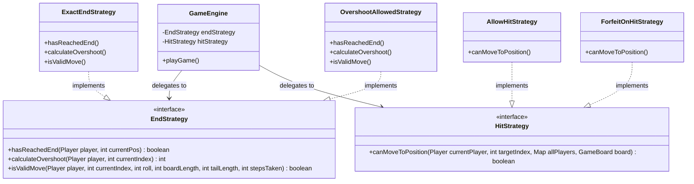

# DanielHall_23748364_FrustrationGame for 6G5Z0059
# Software Design and Architecture

This README explains the **design, architecture** and **implementation** of the Frustration board game.
Part A documents the variations implemented and summarises the design patterns used. Part B then delves into the game flow, providing a more comprehensive view of the design patterns used, how SOLID and Clean Architecture principles are applied, and how the system achieves extensibility through ports, adapters, factories, and domain‑driven abstractions.

## A. Variations implemented

The game demonstrates all required features and variations. 
In order to demonstrate the features, run the game via the **FrustrationGameApplication** class. This will **run two simulations** at runtime.
> 1. **All Game Simulations** - a nested loop will run all variations of the game using random dice.
> 2. **The Scenario Runner** will use fixed dice to demonstrate each of the variations as per the assignment spec.

| Feature                                    | Status | Implementation Details (the code)                                                                | Why this design is good?                                                                                                                                                                                                                                                   | SOLID principles demonstrated                                                                                                  |
|--------------------------------------------|--------|--------------------------------------------------------------------------------------------------|----------------------------------------------------------------------------------------------------------------------------------------------------------------------------------------------------------------------------------------------------------------------------|:-------------------------------------------------------------------------------------------------------------------------------|
| **Dice** - single and double dice          | ✅      | RandomSingleDiceShaker, RandomDoubleDiceShaker, FixedDiceShaker *created via* DiceFactoryGateway | - Dice behaviour uses Interface, so concrete implementation is determined at runtime. - No game engine changes required. - Independent and extensible.                                                                                                             | **OCP** - easy to add / update dice types. **DIP** - engine depends on DiceShaker interface. **SRP** - dice only roll. |
| **Players** - 2 and 4 player               | ✅      | RedPlayer, BluePlayer, GreenPlayer, YellowPlayer *created via* PlayerFactoryGateway              | - Player creation uses Interfaces, again as abstraction works best here allowing concrete implementation at runtime. - Adding further players requires no changes to the game engine.                                                                                  | Similar principles to above. **OCP, DIP** and **SRP** compliant.                                                               |
| **Board** - small and large                | ✅      | SmallGameBoard, LargeGameBoard *created via* BoardFactoryGateway                                 | - Board geometry uses Interfaces, with adapters delivering the implementation requested at runtime. - Movement logic modular and distinct from the game engine.                                                                                                        | Similar principles to above. **OCP, DIP** and **SRP** compliant.                                                               |
| **End** - exact end or overshoot           | ✅      | ExactEndStrategy vs. OvershootAllowedStrategy *created via* EndFactoryGateway                    | - Uses Strategy Patterns. - End rules are isolated, avoiding complex if/else logic. - Easy to add or update end strategies. - Clean separation of rules. No logic in the game engine, making changes independent and increasingly extensible and testable. | **Strategy pattern, OCP** and **DIP** compliant.                                                                               |
| **Hit** - allow or forfeit                 | ✅      | ForfeitOnHitStrategy vs. AllowHitStrategy *created via* HitFactoryGateway                        | - Uses Strategy Patterns. - Collision rules are isolated, avoiding complex if/else logic. - Easy to add or update hit strategies. - No logic in the game engine, making changes independent and increasingly extensible and testable.                          | Similar principles to above. **Strategy pattern, OCP** and **DIP** compliant.                                                  |
| **Game State** - Ready, In Play, Game Over | ✅      | ReadyState, InPlayState, GameOverState                                                           | - Prevents invalid transitions - verifies logic. - Simple, avoiding complex if/else logic. - Independent, allowing further states to be added easily.                                                                                                              | **State pattern, SRP** and **OCP** compliant.                                                                                  |
| **Dependency Injection**                   | ✅      | Spring Boot annotations (e.g @Component, @Service, @Autowired)                                   | - Spring Boot dependency injection manages the lifecycle of runners and services. - Framework is isolated.                                                                                                                                                             | Clean Architecture - **DIP** and **SRP** compliant.                                                                            |
| **Save and Replay**                        | ✅      | TBC                                                                                              |                                                                                                                                                                                                                                                                            |                                                                                                                                |

## High Level Game Flow

The following game diagram explains how the game flows.

This diagram acts as a backbone for the more detailed **explanation of the design patterns** and **principles applied**, and the **rationale** for them.

## B. Game Design Pattern explanation

## 1. Spring Boot Startup (Framework layer)
### What it does
* Spring Boot starts the application, acting as the entry point for the entire game engine.
* The **StartUp** class is a **Spring Component** and **driving adapter**. It listens for the ApplicationReadyEvent, which on activation, *drives* the application by triggering the **RunGame** service.
* Spring Boot will then **manage the Object lifecycle, Dependency Injection** and **Wiring of services** (e.g. *@Service, @Component*).
* No domain class will import Spring.

### ☑ Why is this important for the design
* Spring Boot Dependency Injection provides a cleaner Architectural Framework, often mandatory for building enterprise applications. 
* It wires everything together, holding bean definitions and instances and managing the lifecycle.
* Maintains the framework in the 'outer ring' and ensures the overall domain logic is not tied to Spring.
* Supports Clean Architecture: **Framework -> Infrastructure -> Application -> Domain**.
>* The strength of this approach over alternatives is it removes manual wiring of the game, removes static factories and also global state. 

## 2. Run Game / Scenario Runner (Driving Ports)
### What it does
* Driving ports **drive** the application code 'to do something'. 
* In this case, these classes **drive** the application by selecting which scenarios are run (**ScenarioRunner and RunGameSimulations**).
* This in turn creates *GameConfiguration* objects that are injected via Spring during application StartUp.

### ☑ Why is this important for the design
* Keeps scenario configuration logic separate from the actual game logic - users specify what variations of the game they want to run centrally, without impacting the actual game set-up and logic.
* Allows the addition of new scenarios to be implemented easily.
* Fully aligns to **Single Responsibility Principles (SRP)** and **Open/Closed principles** and improves game extensibility.
* Dependency Injection (as should always be the case) points inwards - **TBC to validate if true and WHY IMPORTANT , removing reliance ON ......** 
>* The strength here is that there is no hard-coded game configuration scenarios within the game engine, or duplication of set-up logic.

## 3. Game Configuration (Ports and Adapters Layer)
* This is where the **orchestration** and **assembly** for the game takes place.
* **GameConfiguration builds the game specification** chosen using:
  * **Ports** (*factory interfaces*) - **MORE DETAIL REQUIRED HIGHLIGHTED IN THE DIAGRAM** role is to define abstract creation ports.......meaning
  * **Adapters** (*implementations*) - **MORE DETAIL REQUIRED** role here is to provide the concrete implementations, based on the users selection.....meaning
  * **Gateways** (*dispatchers*) - **MORE DETAIL REQUIRED** role is to dispatch (NOT GOOD WORD) based on enums the user selection, which are then implemented via the adapters that determine the concrete instantiation required.

| What are.... | What do they do?                                                                                                                                                                                                                           | Examples from the game                                                                                                                                                                  |
|--------------|--------------------------------------------------------------------------------------------------------------------------------------------------------------------------------------------------------------------------------------------|-----------------------------------------------------------------------------------------------------------------------------------------------------------------------------------------|
| **Ports**    | Two types: **Driving ports**: APIs that call into the application. E.g. they *prod* the application code to do something. **Driven ports**: Interfaces the application *depends on*. E.g. application uses these to 'do something' |  *StartUp* calls *RunGame.executeGame()*. *BoardFactory, DiceFactory, HitStrategy, EndStrategy* are interfacess the game depend on to implement game configuration of the user. |
| **Adapters** | Perform the concrete implementation defined by the ports. TBC - ports are interfaces that enable adapters to implement user selections at runtime. SRP compliant.                                                                          | *SmallBoardFactoryAdapter* and *TwoDiceFactoryAdapter*, represent concrete implementations of the driven port interfaces.                                                               |
| **Gateways** | Dispatchers that map the user selected game configuration, in the form of enums, the the adapters to implement the correct concrete implementation.                                                                                        | *BoardFactoryGateway*                                                                                                                                                                   |

### Demonstrating the Factory, Gateway and Adapter set-up demonstration for the Game Board selection (small/large)  

> ☑ **Rationale for the design**
* Using Factories, Gateways and Adapters for specific game set-up activities, means that extending the game (board, dice, rule strategy) requires no changes to the engine. Perfect for **separation of concerns**. 
* **Open/Closed principle** applies to the Board, Dice and Game Strategies, making updates and further extensions simple without modifying the existing game engine. E.g. adding a 3rd dice, bigger board or different strategy is simple as they are open to change without impacting the closed game engine.
* **Dependency Inversion Principle (DIP)** means that the game engine depends on abstract interfaces, rather than concrete implementations. This allows the game to be determined at runtime.
  * Enums are utilised for the various chosen game implementations to simplify instantiation and separate concerns into cleaner encapsulation.
* **Single Responsibility Principle** is key to the game configuration, ensuring the 'nuts and bolts' of the game set-up are isolated from the actual running of the game. This makes game extensibility far easier.

## 4. Game Engine (Application Layer)
The GameEngine is integral to the overall Frustration Game - it **receives the users selection for *number of players, board size, number of dice, game strategy (end and hit) and listeners***
It then orchestrates the game:
* Creating the **PlayersPosition** and wrapping them in the **PlayersInGameContext**, which is used to monitor and track the movement of each player during the game.
  * **TBC Value Objects** are utilised for Players in order to compare board position equality during the game - required to support the Hit Strategy application.
* Creating the **Move Strategy** that players must adhere to, based on the rule strategies deployed in the Game Configuration.
* Setting the **State Machine** to the initial 'ReadyState', and orchestrating the state transition updates.
* Notifying the **Observers** of player/game updates required for tracking and updating the console user of the game progress.

> ☑ **Rationale for the design**
* The GameEngine is in essence, purely a **orchestrator** of the game - there is **no logic held inside the engine**.
* Makes testing game configuration and set-ups easier.
* **TBC - need more SOLID principles**

## 5. State Machine
The State Machine **controls the game lifecycle**. This game deploys a fairly simplistic state machine utilising only 3 states. (CHECK UNI MATERIAL)
### Example below, shows the State Machine for this game

ALSO REFERENCE THE FACT IF ALLOWS TO SAY GAME OVER IF FORCE ANOTHER DICE ROLL, PROVEN USING A TEST CASE - SPECIFY WHICH ONE.
> ☑ **Rationale for the design**
* Using the GameEngine as the orchestrator **avoids creating complex if/else statements** and prevent invalid transitions.
* Makes adding further states easy (e.g. paused, replay) without impacting the rest of the game application.
* Maintains Single Responsibility Principles.
* **TBC - need more SOLID principles**

## 6. Move Strategy (Strategy Layer logic)
Move Strategy is integral to the game (like everything I guess), because it handles a players movements. More specifically, the **StandardMoveStrategy** class handles:
1. **Calculation of a players position** / potential movement based on their dice roll.
2. TBC PRE AND POST VALIDATORS. Validates potential movement dependent on the **EndStrategy and HitStrategy** applied.
3. **Applying the move** (assuming valid).
4. **Notifying listeners** - in order that game progress is recorded appropriately.
5. **Highlighting a player finishing** and winning the game, and driving the resulting output.

> ☑ **Rationale for the design**
* Whilst this game demonstrates two strategies, this design **allows further movement rules to be simply plugged in**, making it easily extensible.
* Likewise, the existing **End and Hit strategies can be amended / extended independently** without impacting the MoveStrategy class,as it relies on the abstract interface class. The specific strategy required is injected in as part of the GameConfiguration, providing the concrete implementation.
* **TBC - need more SOLID principles**

## TBC Pre and post validation of these. Inverters or something I took a pic of. Checks of the rules.

## 7. End & Hit Strategies (Strategy Pattern - handling game variation)
As with many game designs, they often involve the **need to handle different rule sets** (*or strategy*) without rewriting the core game engine. **Strategy Pattern** is used to encapsulate these algorithms.

* Instead of using complex if/else statements inside the game engine, the engine **delegates the decision to a Strategy object**.
* There are two strategies applied in this game, each with their own two implementation strategies.
* End Strategy - supports the rules around where the player must land to win the game.
* Hit Strategy - considers the rules around players collision on the game board.

### Strategy follows the Dependency Inversion Principle (DIP) as demonstrated below

> ☑ SOLID Principles applied
> ☑ **Rationale for the design**
* Both the End and Hit Strategy rules are isolated.
* New rules, such as a *'winning rule'* (e.g. must roll a 6 to finish) can be created, without modifying the existing GameEngine code. This aligns to the **Open/Closed Principle (OCP)**.
* The Engine depends on the abstraction (i.e. EndStrategy), not the details (e.g ExactEndStrategy), which demonstrates the Dependency Inversion Principle (DIP). 
The application uses the Spring Boot Framework for Dependency Injection, managing the lifecycle of the game simulation runners while keeping the core domain logic isolated from the framework itself.

> ☑ 
STATE MACHINE

Summary of Responsibilities
Component           Responsibility
State Pattern       Decision Making: "Am I allowed to move? Should the game end now?"
GameEngine          Orchestration: Holds the state and notifies listeners when things change.
Observers           Representation: Translates those changes into text, colors, or logs for the user.

This keeps your code strictly SOLID. 
The State classes are "Closed" to UI changes but "Open" to behavioral changes.

Adding these methods is not only allowed—it is essential for a clean implementation of the State pattern. In software architecture, your GameEngine acts as the Context. For a Context to work with States, it must provide a set of "hooks" (methods) that the States can call to perform actions.

Here is why this approach reinforces SOLID principles rather than breaking them:

1. It adheres to SRP (Single Responsibility Principle)
   Before the state machine, your GameEngine was responsible for two things:

Executing the move (the physics).

Deciding if the move was valid based on the game's lifecycle (the rules).

By adding executeMoveLogic(), the Engine stays responsible for the "How" (physics), while the State classes take over the "When" (rules). You have actually decoupled the decision-making from the execution.

2. It adheres to OCP (Open/Closed Principle)
   The GameEngine is now closed for modification regarding game flow. If you wanted to add a "Paused" state or a "Penalty" state, you wouldn't have to touch a single line of your playGame() loop. You would simply create a new State class and call the existing "hooks" in the Engine.

This structure is SOLID because:

Engine manages the loop.

State manages the lifecycle.

Strategy manages the board math.

Summary for the "Child's Guide" (Delegation)
this: Think of the Robot (GameEngine) handing a walkie-talkie to the Hat (State). The Robot is saying: "Here is this (my walkie-talkie). If you need me to move a piece or change my mood, just call me on it!"

takeTurn(context, roll): This is the Robot saying: "Hat, here is the player and here is the dice number. You decide what happens next."

Why is this good? It keeps the Robot's brain clean. The Robot doesn't need to know if the game is over; it just trusts that the Red Hat (GameOverState) will tell it the truth.

Why this is SOLID:
SRP: The GameEngine loop only cares about the "Turn Order" and the "Safeguard." It doesn't care about the rules of winning; the InPlayState and MoveStrategy handle that.

LSP (Liskov Substitution): We can swap ReadyState for InPlayState or GameOverState at any time, and the takeTurn method still works perfectly because they all follow the same GameState "contract."

## 8. Player Contexts
4.9 Player Context & Value Objects
PlayersInGameContext tracks:
- Position
- Steps taken
- Move count
- History
- Finished flag
  PlayersPosition tracks:
- Board index
- Tail status
  PlayersMoveHistory tracks:
- Immutable list of moves
  Why this is good:
- Encapsulated state
- No leaking raw indices
- Easy to test and reason about

## 9. Observers
4.10 Observer Pattern for Output
GameListener receives:
- Successful moves
- Blocked moves
- End reached
- End forfeits
- State transitions
- Game over
  Why this is good:
- Engine has no console logic.
- UI can be swapped (GUI, file logging, network logging).
- Tests use MockGameListener.

# Summary of key designs
## SOLID
**TBC**
| Principle              | Purpose and Game example                                                                                | Clean Architecture and importance                                                                                     |
|--------------------|---------------------------------------------------------------------------------------------------------|-----------------------------------------------------------------------------------------------------------------------|
| **Domain**         | Pure business logic  - board, dice, players, strategies, state machine.                             | No outward dependencies, such as on Spring injection, factories or console output. Remains clean and easily testable. |
| **Application**    | Orchestrates the Domain  - GameEngine and GameConfiguration.                                        | Depends only on Domain interfaces (abstract by nature) - never on Infrastructure.                                     |
| **Infrastructure** | Implements the Domain interfaces and external concerns  - observers, factory adapters and gateways. | Dependent on Domain interface abstractions (ports) - never the other way around.                                      |
| **Framework**      | The outermost ring dealing with start-up and dependency injection  - Sprint Boot.                   | Depends on eve

## Clean Architecture

EXPLAIN ABOUT CLEAN ARCHTIECTURE AND THE DOMAIN MODEL/ VOLATILE ELEMENTS ARE KEPT SEPERATE - following DIP.

Inline with the Clean Architecture principles, you can see that the Frustration game ensures **all dependencies point inwards** towards the most stable part of the system - the **domain layer**, with all other aspects of the game dependent on it.

In Clean Architecture:
- Outer layers may depend on inner layers
- Inner layers must never depend on outer layers
- Dependencies always point towards the core domain

Why this is good
- The domain is pure, testable, and framework‑agnostic
- You can replace the UI, logging, or factories without touching the engine
- You can add new rules without modifying existing logic
- The system is stable, extensible, and easy to reason about

## Frustration Game - Clean Architecture summaries
### Demonstration of the game architecture:

### Game - Clean Architecture summary table:

| Layer              | Purpose and Game example                                                                                | Clean Architecture and importance                                                                                     |
|--------------------|---------------------------------------------------------------------------------------------------------|-----------------------------------------------------------------------------------------------------------------------|
| **Domain**         | Pure business logic  - board, dice, players, strategies, state machine.                             | No outward dependencies, such as on Spring injection, factories or console output. Remains clean and easily testable. |
| **Application**    | Orchestrates the Domain  - GameEngine and GameConfiguration.                                        | Depends only on Domain interfaces (abstract by nature) - never on Infrastructure.                                     |
| **Infrastructure** | Implements the Domain interfaces and external concerns  - observers, factory adapters and gateways. | Dependent on Domain interface abstractions (ports) - never the other way around.                                      |
| **Framework**      | The outermost ring dealing with start-up and dependency injection  - Sprint Boot.                   | Depends on everything else, but nothing should depend on it.                                                          | 

# REFLECTION
This was as the name suggests, a frustrating, but rewarding challenge.
Unsuprisingly there are many ways to create the game, all with merit, but ultimately this is what I choose.
I needed to start again, re-add Spring Boot.
Get frustated as game looped (end strategy) issue

DON'T FORGET TO REFERENCE ENCAPSULATION, ENUMS, OBJECT ORIENTATION, POLYMORPHISM ETC.

If time allowed, I might have restructured packages to
Packages
- Reflect Clean Architecture layers:
- board, dice, players, gamestrategies → domain
- rungame → application
- factories.*, gameobserver → infrastructure
- boot → framework

* TBC - throughout the game packages and encapsulation are used to ensure private XYZ
* Factories - good, why and when used.
* Dependencies always point inwards.
* Lab 10 infrastructure vs application domain models
* RECORDS used, where and why?